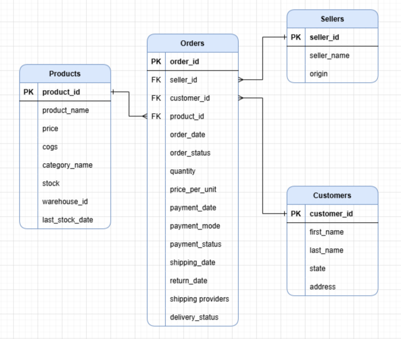

# Amazon Sales Analysis

A comprehensive SQL analytics project demonstrating business intelligence and data analysis capabilities through real-world e-commerce scenarios — built on a PostgreSQL database migrated from a normalized relational schema to a streamlined Star Schema.

---

## About This Project

This project showcases advanced SQL expertise through 10 complex business analytics queries designed for an Amazon-like e-commerce platform. Each query addresses a real operational challenge faced by online marketplaces, from customer retention and inventory optimization to seller performance and revenue trend analysis.

**Database:** PostgreSQL

---

## Database Schema

### Original Schema — Normalized (9 Tables)

The project began with a fully normalized relational schema designed to eliminate redundancy and enforce data integrity. It consisted of 9 tables:

- **Orders** — core transaction table
- **Order Items** — line items per order
- **Products** — product catalog
- **Category** — product categories
- **Customers** — customer profiles
- **Sellers** — seller information
- **Payments** — payment records per order
- **Shippings** — shipping and delivery records
- **Inventory** — stock levels per product/warehouse

The ER diagram for the original schema was designed and visualized using **draw.io**.

---

### Migrated Schema — Star Schema (4 Tables)

To optimize for analytical querying and reporting performance, the original 9-table schema was **migrated to a Star Schema** — consolidating related tables and denormalizing data into a single fact table surrounded by three dimension tables. The migration was performed using **Pandas**, which was used to merge, reshape, and transform the original tables before loading the restructured data into PostgreSQL.

**1 Fact Table + 3 Dimension Tables:**

| Table | Type | Key Columns |
|---|---|---|
| `fact_orders` | Fact | order_id, customer_id, seller_id, product_id, order_date, order_status, quantity, price_per_unit, payment_date, payment_mode, payment_status, shipping_date, return_date, shipping_providers, delivery_status |
| `dim_customers` | Dimension | customer_id, first_name, last_name, state, address |
| `dim_sellers` | Dimension | seller_id, seller_name, origin |
| `dim_products` | Dimension | product_id, product_name, price, cogs, category_name, stock |

The migration collapsed Payments, Shippings, Order Items, Category, and Inventory into the fact and dimension tables, reducing join complexity and making analytical queries significantly more efficient.

Following the schema setup, indexes were created on `fact_orders` for frequently queried columns (`customer_id`, `seller_id`, `product_id`, `order_date`, `order_status`, `delivery_status`) to optimize join and filter performance across all analytical queries.

---

## Business Problems Solved

| # | Problem Statement |
|---|---|
| 1 | **Customer Retention Analysis** — Identify high-value customers (LTV > $5,000) showing signs of churn (no purchase in 90+ days) |
| 2 | **Quarterly Category Performance Matrix** — Pivot revenue by category across Q1 2023 – Q1 2024 |
| 3 | **Revenue by Category** — Calculate each category's percentage contribution to overall revenue |
| 4 | **Least-Selling Categories by State** — Identify the weakest product category per state for regional strategy |
| 5 | **Product Returns Root Cause** — Flag products with >5% return rates and determine if cause is seller- or shipping-related |
| 6 | **Revenue Decline YoY Analysis** — Detect products with declining revenue year-over-year |
| 7 | **Inactive Seller Identification** — Surface sellers with no sales activity in recent periods |
| 8 | **Inventory Optimization for High-Margin Products** — Flag high-margin, fast-moving products at risk of stockout |
| 9 | **Underperforming Sellers Analysis** — Find sellers with high order volume but low AOV, and recommend high-value categories |
| 10 | **Monthly Seller Performance Report Function** — Reusable PL/pgSQL function generating ranked seller reports for any month/year |

---

## Key Skills Demonstrated

- **SQL**: CTEs, window functions (`RANK`, `LAG`, `ROW_NUMBER`), `CROSSTAB` pivots, complex multi-table joins, correlated subqueries
- **Star Schema Design**: Migrated a 9-table normalized schema to a 4-table star schema optimized for analytics
- **Business Analytics**: Customer segmentation, churn detection, regional performance, return root-cause analysis, YoY trend analysis, inventory management
- **Database Programming**: PL/pgSQL stored functions with dynamic date parameters and reusable reporting logic
- **Query Optimization**: Performance-conscious query design leveraging denormalized star schema structure and targeted indexing on high-frequency join and filter columns
